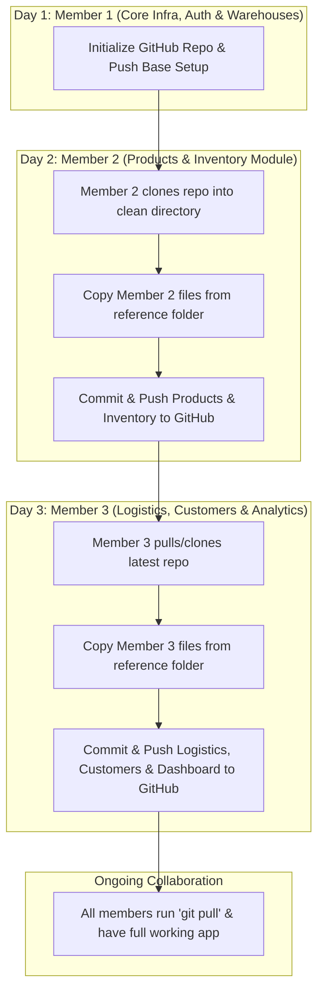

# Project Handover & Team Contribution Guide
**Project Name:** Warehouse & Logistics Management System (`WebDev_Project02` / `Web_Final_Project_2`)

---

## 1. Quick Start Guide for Team AI Coding Agents

If you are an AI Coding Agent (Cursor, Claude, ChatGPT, Copilot, Antigravity) assisting one of the 3 team members, read this section immediately:

### System Architecture Summary
* **Frontend:** React 18 SPA (Vite), React Router v6, TanStack React Query, Lucide Icons, Recharts, Vanilla CSS (Dark Glassmorphism).
* **Backend:** Next.js (App Router API server on `http://localhost:3000`), Mongoose (MongoDB ODM), JWT (`jose`), Bcrypt.
* **API Proxy:** The frontend (`http://localhost:5173`) proxies `/api/*` requests directly to `http://localhost:3000` via `vite.config.js`.
* **Database & Auth:** MongoDB connection string (`MONGODB_URI`) and JWT secret (`JWT_SECRET`) must be in `backend/.env.local`.
* **RBAC Roles:** `ADMIN`, `WAREHOUSE_STAFF`, `LOGISTICS_STAFF`.

---

## 2. Staged Collaboration Workflow (Option A)

To prove **~20 hours of individual contribution per member** without risking broken code:
1. **Source Package:** All members receive the complete reference folder (`Web_Final_Project_2`).
2. **GitHub Flow:** Members push their assigned modules sequentially over different days/sessions.
3. **Branching/PRs:** Member 1 sets up `main`, Member 2 adds Products/Inventory, Member 3 adds Logistics/Analytics.



---

## 3. Member 1 Guide: Core Infrastructure, Auth & Warehouses

### Assigned Responsibilities:
* Project initialization, configurations, Docker containerization, root README/Docs.
* Database connection manager (`src/lib/dbConnect.js`), RBAC middleware (`src/middleware.js`), User/Warehouse models (`src/models/index.js`).
* Auth APIs (`/api/auth/login`, `/api/auth/register`) and Warehouses API (`/api/warehouses`).
* Frontend core architecture (`App.jsx`, `main.jsx`, `index.css`, `Sidebar.jsx`, `Login.jsx`, `Register.jsx`, `Warehouses.jsx`).

### Prompt for Member 1's AI Agent:
> *"I am Member 1. Help me initialize our GitHub repository from `Web_Final_Project_2`, stage only Member 1's foundation files (Core infra, Auth, Warehouses, Docker), and push the initial commit to `main`."*

### Step-by-Step Commands for Member 1:
```bash
cd "/Users/bright/Desktop/1-2026/Web Dev/Web_Final_Project_2"

# 1. Initialize Git Repo
git init
git branch -M main
git remote add origin https://github.com/<your-username>/<repo-name>.git

# 2. Stage Documentation, Configurations & DevOps
git add .gitignore docker-compose.yml HANDOVER.md IMPLEMENTATION_PLAN.md Warehouse_Logistics_Management_System_Proposal.docx
git add backend/package.json backend/package-lock.json backend/next.config.mjs backend/Dockerfile backend/README.md backend/eslint.config.mjs backend/jsconfig.json backend/postcss.config.mjs backend/public/
git add backend/src/app/globals.css backend/src/app/layout.js backend/src/app/page.js backend/src/app/favicon.ico
git add frontend/package.json frontend/package-lock.json frontend/vite.config.js frontend/Dockerfile frontend/index.html frontend/vercel.json frontend/.oxlintrc.json frontend/public/ frontend/src/assets/

# 3. Stage Member 1 Backend Code
git add backend/src/lib/dbConnect.js backend/src/middleware.js backend/src/models/index.js
git add backend/src/app/api/auth/ backend/src/app/api/warehouses/

# 4. Stage Member 1 Frontend Code
git add frontend/src/main.jsx frontend/src/App.jsx frontend/src/index.css frontend/src/App.css
git add frontend/src/components/Sidebar.jsx
git add frontend/src/pages/Login.jsx frontend/src/pages/Register.jsx frontend/src/pages/Warehouses.jsx

# 5. Commit and Push
git commit -m "feat(core): initialize project architecture, auth, RBAC, and warehouse management"
git push -u origin main
```
*After pushing, Member 1 adds Member 2 and Member 3 as Collaborators on GitHub.*

---

## 4. Member 2 Guide: Product Catalog & Inventory Stock Management

### Assigned Responsibilities:
* Product catalog REST APIs (`/api/products`, `/api/products/[id]`).
* Inventory stock allocation & capacity validation REST APIs (`/api/inventory`, `/api/inventory/[id]`).
* Frontend Product Catalog page (`Products.jsx`) and Inventory Management page (`Inventory.jsx`).

### Prompt for Member 2's AI Agent:
> *"I am Member 2. Help me clone our team's repository, copy the Products and Inventory module files from our reference folder `Web_Final_Project_2` into the repository, verify everything works, and commit/push my module to GitHub."*

### Step-by-Step Commands for Member 2:
```bash
# 1. Clone the team repo
git clone https://github.com/<username>/<repo-name>.git my-team-repo
cd my-team-repo

# 2. Add .env.local to backend (shared privately by team)
# (Ensure backend/.env.local contains MONGODB_URI and JWT_SECRET)

# 3. Copy Member 2 Files from the reference folder:
# Backend:
cp -r "/path/to/reference/Web_Final_Project_2/backend/src/app/api/products" backend/src/app/api/
cp -r "/path/to/reference/Web_Final_Project_2/backend/src/app/api/inventory" backend/src/app/api/

# Frontend:
cp "/path/to/reference/Web_Final_Project_2/frontend/src/pages/Products.jsx" frontend/src/pages/
cp "/path/to/reference/Web_Final_Project_2/frontend/src/pages/Inventory.jsx" frontend/src/pages/

# 4. Stage, Commit and Push
git add backend/src/app/api/products/ backend/src/app/api/inventory/
git add frontend/src/pages/Products.jsx frontend/src/pages/Inventory.jsx
git commit -m "feat(inventory): implement product catalog, warehouse stock allocation, and low-stock alerts"
git push origin main
```

---

## 5. Member 3 Guide: Logistics Pipeline, Customers & Executive Analytics

### Assigned Responsibilities:
* Customer registry REST APIs (`/api/customers`, `/api/customers/[id]`).
* Outbound Shipments pipeline REST APIs with Product & Unit Amount tracking (`/api/shipments`, `/api/shipments/[id]`).
* Aggregated Dashboard Statistics REST API (`/api/stats`) covering all 5 shipment statuses: *Pending, Processing, In Transit, Delivered, Cancelled*.
* Frontend Customer Registry page (`Customers.jsx`), Shipments Logistics page with Product & Units selector/column (`Shipments.jsx`), Universal Search Shell (`DashboardLayout.jsx`), and Executive Overview Dashboard with Recharts bar chart (`Dashboard.jsx`).

### Prompt for Member 3's AI Agent:
> *"I am Member 3. Help me pull/clone the latest team repository, copy the Logistics, Customers, and Analytics Dashboard files from our reference folder `Web_Final_Project_2` into the repository, test the live dashboard and shipment tracking, and commit/push my module to GitHub."*

### Step-by-Step Commands for Member 3:
```bash
# 1. Clone or pull the latest repo
cd my-team-repo
git pull origin main

# 2. Copy Member 3 Files from the reference folder:
# Backend:
cp -r "/path/to/reference/Web_Final_Project_2/backend/src/app/api/customers" backend/src/app/api/
cp -r "/path/to/reference/Web_Final_Project_2/backend/src/app/api/shipments" backend/src/app/api/
cp -r "/path/to/reference/Web_Final_Project_2/backend/src/app/api/stats" backend/src/app/api/

# Frontend:
cp "/path/to/reference/Web_Final_Project_2/frontend/src/pages/Customers.jsx" frontend/src/pages/
cp "/path/to/reference/Web_Final_Project_2/frontend/src/pages/Shipments.jsx" frontend/src/pages/
cp "/path/to/reference/Web_Final_Project_2/frontend/src/pages/DashboardLayout.jsx" frontend/src/pages/
cp "/path/to/reference/Web_Final_Project_2/frontend/src/pages/Dashboard.jsx" frontend/src/pages/

# 3. Stage, Commit and Push
git add backend/src/app/api/customers/ backend/src/app/api/shipments/ backend/src/app/api/stats/
git add frontend/src/pages/Customers.jsx frontend/src/pages/Shipments.jsx frontend/src/pages/DashboardLayout.jsx frontend/src/pages/Dashboard.jsx
git commit -m "feat(logistics): add shipment tracking with product unit amounts, customer registry, and live executive analytics dashboard"
git push origin main
```

---

## 6. Verification & Running the App Locally

### Backend Server (`/backend`):
```bash
cd backend
npm install
npm run dev
# Note: On Mac Apple Silicon, if SWC Turbopack error occurs:
# npx next dev --webpack
```
* Runs on: `http://localhost:3000`
* Required in `backend/.env.local`:
  ```env
  MONGODB_URI=mongodb+srv://<user>:<password>@cluster.mongodb.net/warehouse_db?retryWrites=true&w=majority
  JWT_SECRET=super_secret_jwt_key_12345
  ```

### Frontend Server (`/frontend`):
```bash
cd frontend
npm install
npm run dev
```
* Runs on: `http://localhost:5173`
* No `.env` needed for frontend — `vite.config.js` proxies `/api` to `localhost:3000`.

---

## 7. Testing Checklist for All Members
- [x] Register account as `ADMIN` (e.g. `admin@logistics.com` / `AdminPass123!`).
- [x] Create a Warehouse in `/dashboard/warehouses`.
- [x] Create a Product in `/dashboard/products`.
- [x] Allocate stock to the Warehouse in `/dashboard/inventory`.
- [x] Create a Customer in `/dashboard/customers`.
- [x] Create an Outbound Shipment in `/dashboard/shipments` with Product & Unit Amount.
- [x] Check `/dashboard` to verify real-time status count cards (Pending, Processing, In Transit, Delivered, Cancelled) and bar chart.
