# Nexus Logistics (Web Project O2)

## Team Members
- [BrightTzy](https://github.com/BrightTzy)
- [Min Khant Tin](https://github.com/manisandar)
- [Shin Thant Aung](https://github.com/shinthant-aung)

**Team Repository:** [https://github.com/BrightTzy/Web_Project_O2](https://github.com/BrightTzy/Web_Project_O2)

## Project Description
It is a comprehensive full-stack web application designed to streamline warehouse operations, inventory management, and outbound logistics. Built on a modern tech stack (React Frontend, Next.js API Backend, MongoDB), the system implements strong Role-Based Access Control (RBAC) to ensure different staff members see only what they need.

**Key Features:**
- **Admin Dashboard:** Executive overview of total products, active warehouses, and real-time shipment distribution.
- **Warehouse Hub:** Allows Warehouse Staff to monitor stock capacity, receive low-stock alerts, and manage incoming inventory.
- **Logistics Hub:** Empowers Logistics Staff to create, track, and update shipments, with automatic capacity validation and inventory deduction upon delivery.
- **Cloud Deployment:** Fully deployed on Microsoft Azure

## Screenshots & User Guide

### 1. Log-in Screen
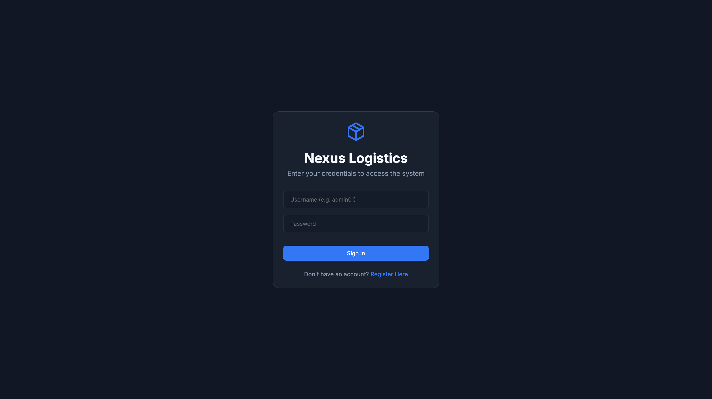
**How to use:** This is the secure entry point to the system. Users must log in with their registered username and password. The system will automatically detect their role (Admin, Warehouse Staff, or Logistics Staff) and route them to their specific dashboard, hiding unauthorized pages.

### 2. Register Screen
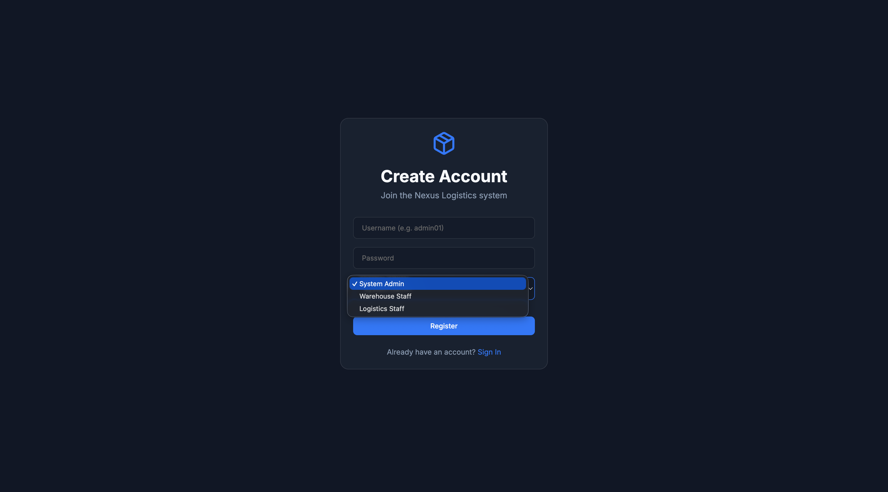
**How to use:** New employees use this page to create an account. They will enter their details and select their specific role. Once registered, their permissions are strictly bound to the role they selected.

### 3. Admin Access
As an Admin, you have unrestricted access to oversee the entire logistics network.

#### 3.1 Admin Dashboard
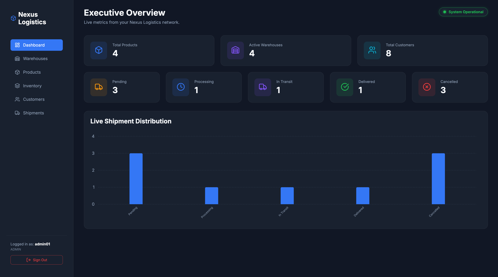
**How to use:** This page provides an executive overview. You can see high-level metrics including total registered products, active warehouses, and total customers. The interactive bar chart updates in real-time to show the exact status distribution of all shipments across the network.

#### 3.2 Admin Warehouse
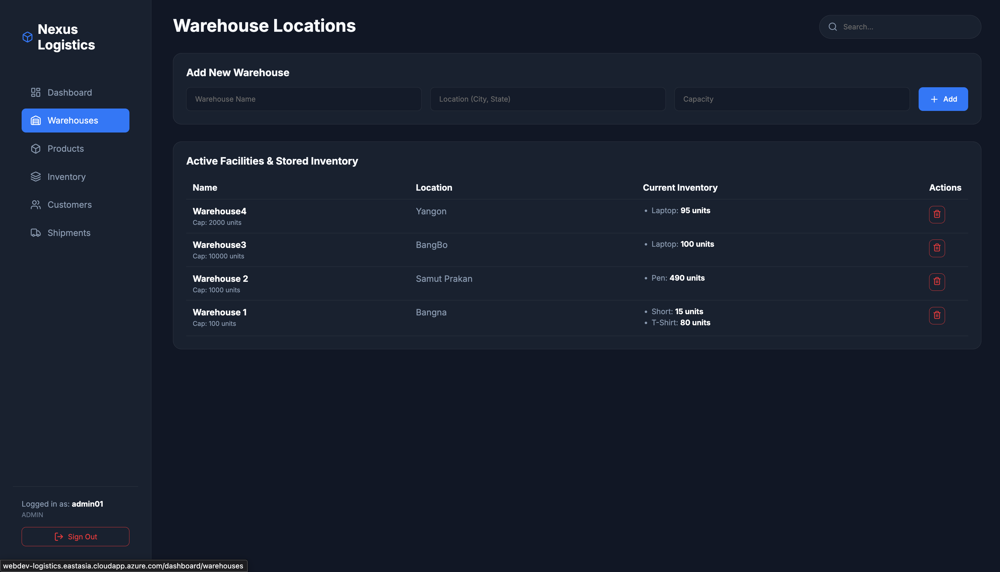
**How to use:** Use this page to manage your physical infrastructure. Admins can register new physical warehouse locations and define the maximum unit capacity each facility can hold.

#### 3.3 Admin Products
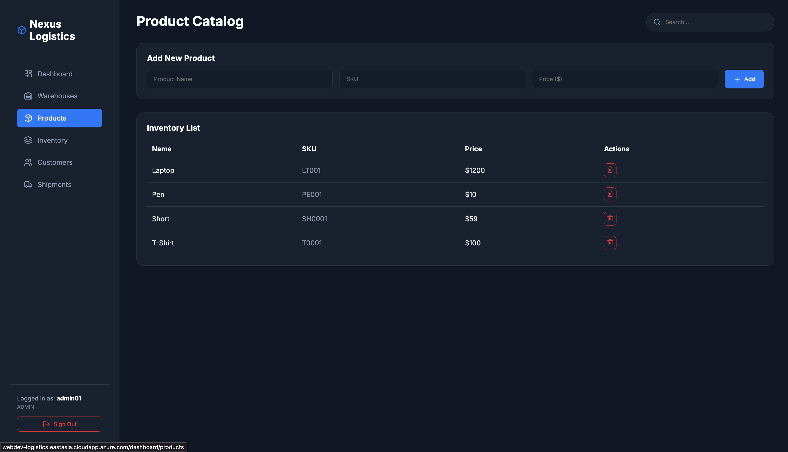
**How to use:** This acts as the master catalog. Use this page to register new types of products your company handles by entering a product name, a unique SKU (Stock Keeping Unit), and a base price.

#### 3.4 Admin Inventory
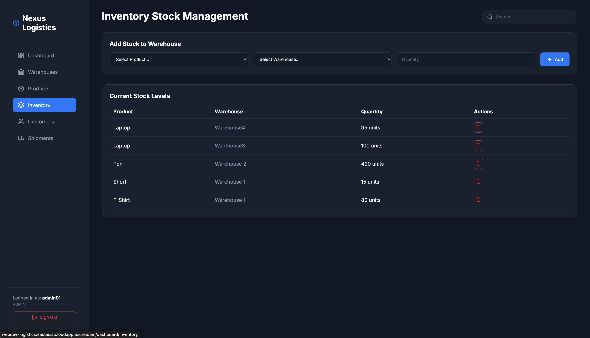
**How to use:** This page manages physical stock. You can assign registered products to specific warehouses and declare how many units are available. The system automatically calculates capacity limits and will prevent you from overfilling a warehouse.

#### 3.5 Admin Customers
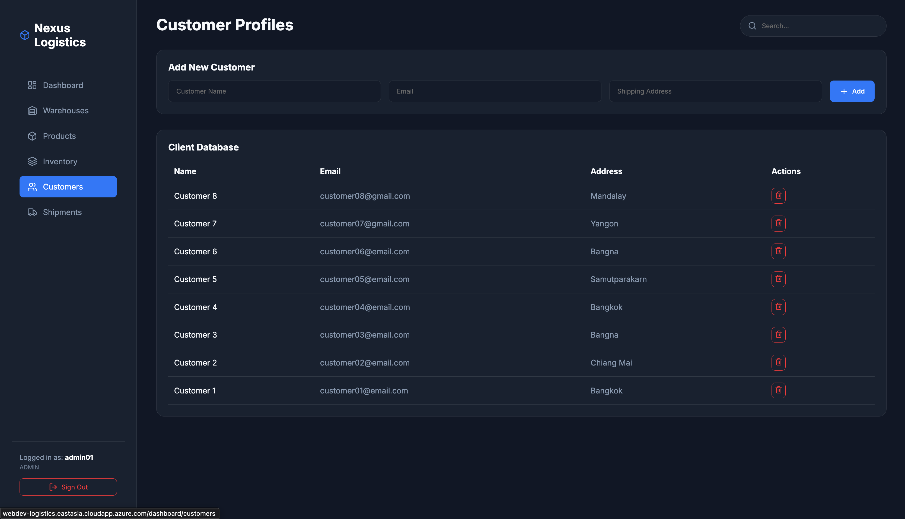
**How to use:** Use this page to build a client base. You can register new recipient profiles, including their name, email, and exact delivery address.

#### 3.6 Admin Shipment
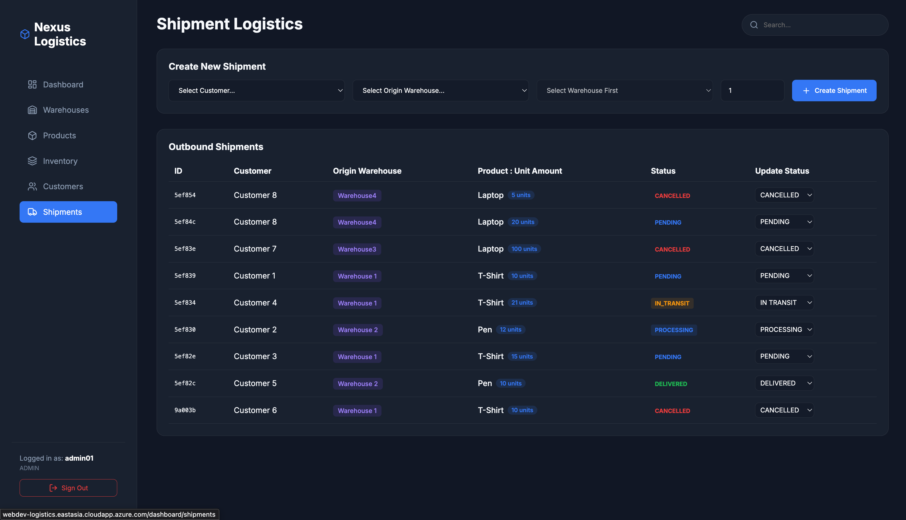
**How to use:** Use this page to oversee all outbound logistics. You can view all created shipments, the assigned warehouse, the product being delivered, and the customer receiving it.

### 4. Warehouse Staff Access
As Warehouse Staff, your primary focus is managing the product catalog and physical stock levels.

#### 4.1 Warehouse Dashboard
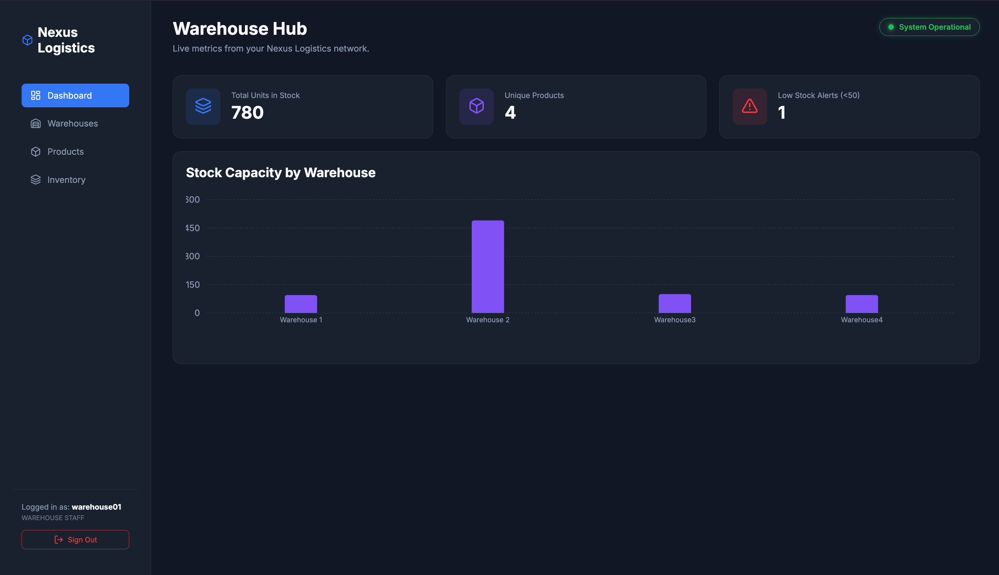
**How to use:** This is your primary dashboard. It provides a specialized chart aggregating the live stock capacity currently sitting inside each warehouse, allowing you to instantly identify which facilities are healthy and which have low stock.

#### 4.2 Warehouse Products
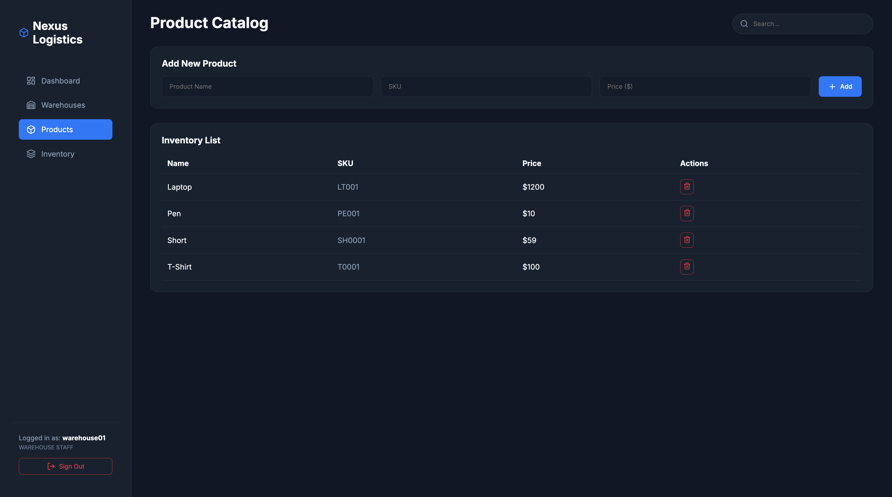
**How to use:** Use this page to register new types of products to the master catalog by entering a product name, SKU, and price.

#### 4.3 Warehouse Inventory
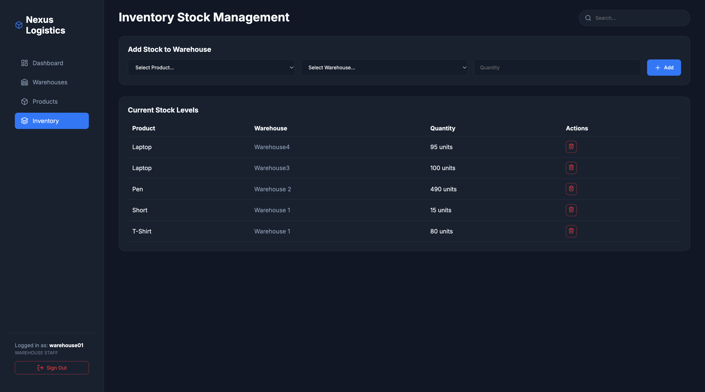
**How to use:** Use this page to assign registered products to specific warehouses and manage available stock. The system automatically calculates capacity limits and prevents overfilling.

### 5. Logistics Staff Access
As Logistics Staff, your responsibility is managing clients and executing outbound deliveries.

#### 5.1 Logistics Dashboard
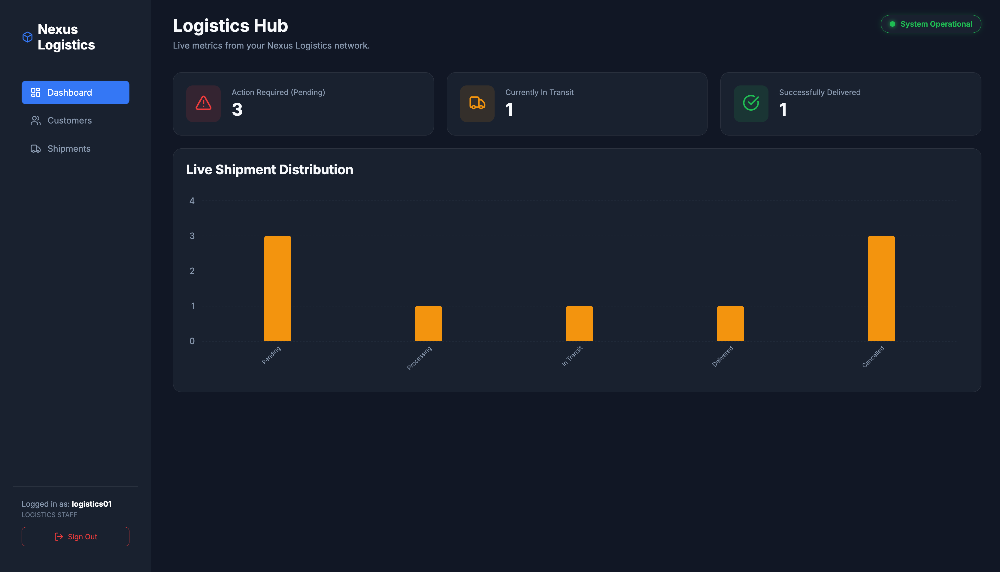
**How to use:** This dashboard provides a quick overview of shipments that require action (pending), shipments in transit, and those successfully delivered.

#### 5.2 Logistics Customers
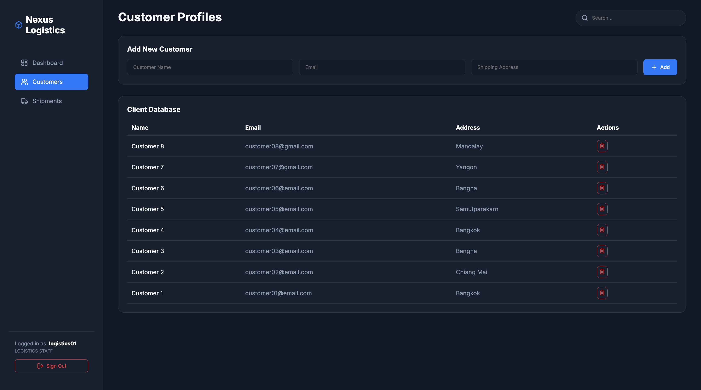
**How to use:** Use this page to register new recipient profiles, including their name, email, and exact delivery address.

#### 5.3 Logistics Shipment
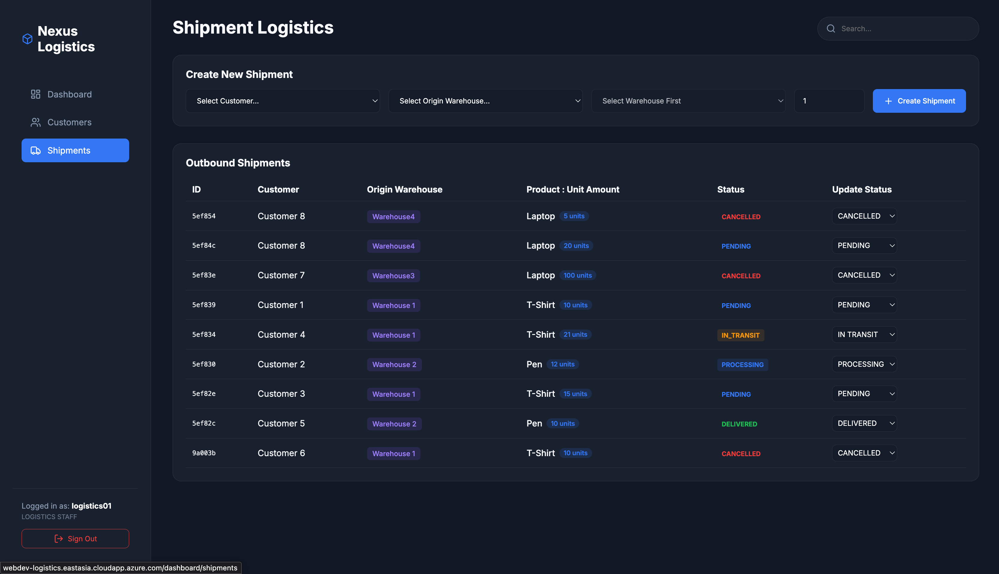
**How to use:** This page is used to execute deliveries. 
1. Select a Customer and an Origin Warehouse.
2. The Product dropdown will dynamically update to ONLY show products that physically exist in that specific warehouse, displaying exact stock numbers.
3. Select the quantity and create the shipment (defaults to `PENDING`).
4. Update the shipment status as it moves. Once changed to `DELIVERED`, the backend automatically deducts that stock from the warehouse's inventory!

---
*Developed for Web Development Project 2 (2026)*
